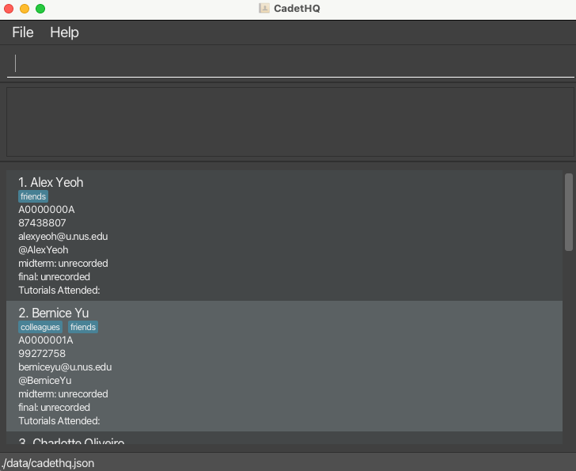
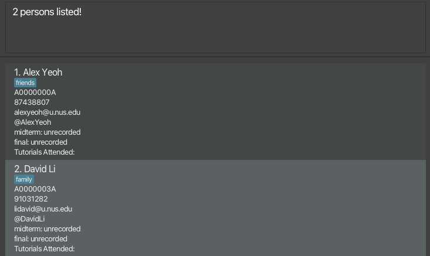
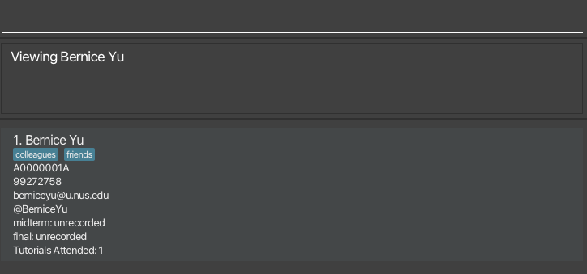
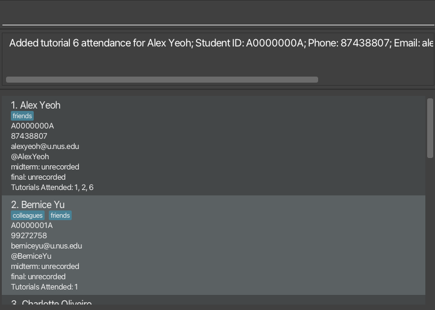
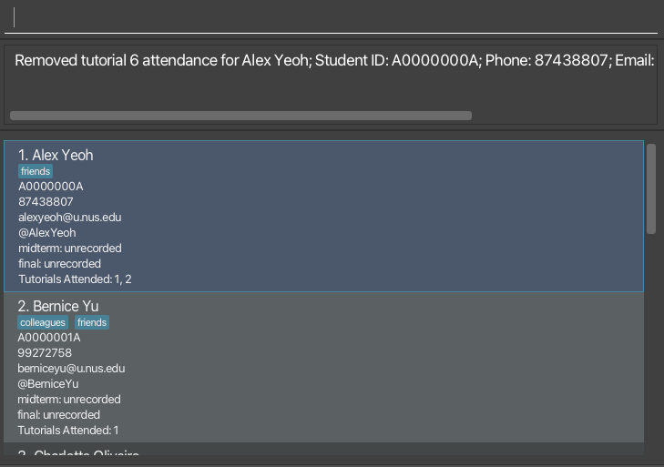
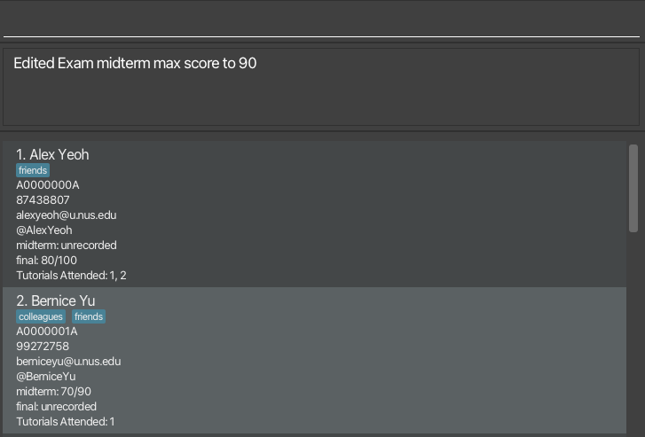

CadetHQ is a **desktop app for managing student contacts, for CS1101S Teaching Assistants (TAs) at National University of Singapore (NUS)**. 

It is optimized for use via a **Command Line Interface** (CLI) while still having the benefits of a Graphical User Interface (GUI).

For CS1101S TAs that are good at using the Command Line, CadetHQ gives you the power to manage your students' grades, attendance, and contact information quickly, bypassing pesky menus that take ages to load and navigate.

#### Main features:
 - [Managing Students](#managing-students) - Add, edit or delete student records.
 - [Viewing Students](#viewing-students) - View, search or sort student information.
 - [Tracking Attendance](#tracking-attendance) - Record students' attendance.
 - [Handling Scores](#handling-scores) - Manage students' scores and modify exam scoring details.

[Skip to Command Summary](#command-summary)

---

### Table of Contents:
- [Quick start](#quick-start)
- [Features](#features)
  - [Managing Students](#managing-students)
    - [Adding a student](#adding-a-student-add)
    - [Editing a student](#editing-a-student-edit)
    - [Deleting a student](#deleting-a-student-delete)
  - [Viewing Students](#viewing-students)
    - [Listing all students](#listing-all-students-list)
    - [Locating students by name](#locating-students-by-name-find)
    - [Viewing a student](#viewing-a-student-view)
    - [Sorting students](#sorting-students-sort)
  - [Tracking Attendance](#tracking-attendance)
    - [Marking the attendance for a student](#marking-the-attendance-for-a-student-attend)
  - [Handling Scores](#handling-scores)
    - [Adding a score for an exam for a student](#adding-a-score-for-an-exam-for-a-student-score)
    - [Editing the max score of an exam](#editing-the-max-score-of-an-exam-maxscore)
  - [Miscellaneous](#miscellaneous)
    - [Clearing all entries](#clearing-all-entries-clear)
    - [Exiting the program](#exiting-the-program-exit)
    - [Saving the data](#saving-the-data)
    - [Editing the data file](#editing-the-data-file)
    - [Archiving data files](#archiving-data-files-coming-in-v20)
- [FAQ](#faq)
- [Known issues](#known-issues)
- [Command summary](#command-summary)

--------------------------------------------------------------------------------------------------------------------

# Quick start

Note that throughout this document, we will often refer to CadetHQ as Address Book whenever appropriate.

1. Ensure you have Java `17` or above installed in your Computer. 
   **Mac users:** Ensure you have the precise JDK version prescribed [here](https://se-education.org/guides/tutorials/javaInstallationMac.html).

1. Download the latest `.jar` file from [here](https://github.com/AY2526S1-CS2103T-T11-2/tp/releases).

1. Copy the file to the folder you want to use as the _home folder_ for your CadetHQ.

1. Open a command terminal, `cd` into the folder you put the jar file in, and use the `java -jar cadethq.jar` command to run the application. 
   A GUI similar to the below should appear in a few seconds. Note how the app contains some placeholder data. 
   

1. Type the command in the command box and press Enter to execute it. e.g. typing **`help`** and pressing Enter will open the help window. 
   Some example commands you can try:

   * `list` : Lists all contacts.

   * `add A1234567A n/John Doe p/98765432 e/johnd@u.nus.edu h/@JohnDoe` : Adds a contact named `John Doe` to the Address Book.

   * `delete 3` : Deletes the 3rd contact shown in the current list.

   * `clear` : Deletes all contacts.

   * `exit` : Exits the app.

1. Refer to the [Features](#features) below for details of each command.

--------------------------------------------------------------------------------------------------------------------

## Contact Details
A table of all the information that can be associated with a contact

| Name             | Prefix | Example         | Constraints                                                                                                                                                                                |
|------------------|--------|-----------------|--------------------------------------------------------------------------------------------------------------------------------------------------------------------------------------------|
| Index            |        | 1               | - Must be a positive integer                                                                                                                                                               |
| Student ID (SID) |        | A0123456A       | - Must be 9-characters long   - First character must be "A" or “a”   - Second to eighth characters must be a number  - Last character must be an alphabet   (case-insensitive) |
| Name             | n/     | John Doe        | - Only alphanumeric characters and spaces                                                                                                                                                  |
| Phone number     | p/     | 98765432        | - Must consist of 8 digits   - Must start with the number "6", "8" or "9"                                                                                                                    |
| Email            | e/     | johnd@u.nus.edu | - Must be of the format *local-part* @u.nus.edu   - *local-part* should only contain alphanumeric characters                                                           |
| Telegram handle  | h/     | JohnDoe         | - Must start with "@"   - Remaining characters must be alphanumeric or underscores                                                                                                      |
| Tag              | t/     | Friend          | - Should be alphanumeric                                                                                                                                                                   |

The index refers to the index number shown in the displayed person list.

When entering a contact detail as a parameter for any command:
- Input parameter should be preceded by its associated prefix.
- Input parameter must adhere to listed constraints, the command will not execute otherwise.

# Features

**:information_source: Notes about the command format:** 

* Words in `UPPER_CASE` are the parameters to be supplied by the user. 
  e.g. in `add n/NAME`, `NAME` is a parameter which can be used as `add n/John Doe`.

* Items in square brackets are optional. 
  e.g `n/NAME [t/TAG]` can be used as `n/John Doe t/friend` or as `n/John Doe`.

* Items with `…`​ after them can be used multiple times including zero times. 
  e.g. `[t/TAG]…​` can be used as ` ` (i.e. 0 times), `t/friend`, `t/friend t/family` etc.

* Parameters can be in any order. 
  e.g. if the command specifies `n/NAME p/PHONE_NUMBER`, `p/PHONE_NUMBER n/NAME` is also acceptable.

* Extraneous parameters for commands that do not take in parameters (such as `help`, `list`, `exit` and `clear`) will be ignored. 
  e.g. if the command specifies `help 123`, it will be interpreted as `help`.

* If you are using a PDF version of this document, be careful when copying and pasting commands that span multiple lines as space characters surrounding line-breaks may be omitted when copied over to the application.

* All formats accept multiple spaces in between parameters. e.g. `score ‎ ‎  1 ‎ ‎ ‎   ex/  ‎ ‎  midterm  s/50` will be interpreted as `score 1 ex/midterm s/50`

* `SID` refers to the Student ID.

---

### Viewing help: `help`

Shows a message explaining how to access the help page.

Format: `help`

---

## Managing Students

### Adding a student: `add`

Adds a student to the Address Book.

Format: `add SID n/NAME p/PHONE_NUMBER e/EMAIL h/TELEGRAM_HANDLE [t/TAG]…​`

:bulb: **Tip:**
A person can have 0 or more tags!

* All parameters must not be blank
* All parameters must adhere to constraints detailed in [Contact Details](#contact-details)

Examples:
* `add A0123456A n/John Doe p/98765432 e/johnd@u.nus.edu h/@JohnDoe`

* `add A1234567B n/Betsy Crowe t/friend e/betsycrowe@u.nus.edu p/89891206 t/needshelp h/@BetsyC`

:exclamation: **Warning:**
Duplicate students cannot be added to the Address Book. A student is considered a duplicate student if either the SID or the email are the same as another existing student in the Address Book.

### Editing a student: `edit`

Edits an existing student in the Address Book.

Format: `edit INDEX [n/NAME] [p/PHONE] [e/EMAIL] [h/TELEGRAM_HANDLE] [t/TAG]…​` or `edit SID [n/NAME] [p/PHONE] [e/EMAIL] [h/TELEGRAM_HANDLE] [t/TAG]…​`

* Edits the person at the specified `INDEX` or with the given `SID`. 
* All parameters must not be blank
* All parameters must adhere to constraints detailed in [Contact Details](#contact-details)

:exclamation: **Warning:**
At least one of the optional fields must be provided.

:exclamation: **Warning:**
Existing values will be updated to the input values.

:exclamation: **Warning:**
If email is being edited, it must be a unique email not currently present in the Address Book.

:exclamation: **Warning:**
When editing tags, the existing tags of the student will be removed i.e. adding of tags is not cumulative.

:bulb: **Tip:**
You can remove all the student’s tags by typing `t/` without specifying any tags after it.

Examples:
*  `edit 1 p/91234567 e/alexyeohh@u.nus.edu` Edits the phone number and email address of the 1st student to be `91234567` and `alexyeohh@u.nus.edu` respectively.
*  `edit A0000000A n/Betsy Crower t/ p/92345678 h/@BetsyC` Edits the name of the student with SID `A0000000A` to be `Betsy Crower`, with phone number `92345678` and Telegram handle `@BetsyC`, and clears all existing tags.

### Deleting a student: `delete`

Deletes the specified student from the Address Book.

Format: `delete INDEX` or `delete SID`

* Deletes the student at the specified `INDEX` or with the given `SID`.
* `INDEX` and `SID` parameters must adhere to constraints detailed in [Contact Details](#contact-details)

Examples:
* `list` followed by `delete 2` deletes the 2nd student in the Address Book.
* `find Betsy` followed by `delete 1` deletes the 1st student in the results of the `find` command.
* `list` followed by `delete A0123456Z` deletes the student in the Address Book with the student ID `A0123456Z`.

---
## Viewing Students

### Listing all students: `list`

Shows a list of all students in the Address Book.

Format: `list`

### Locating students by name: `find`

Finds students whose names contain any of the given keywords.

Format: `find KEYWORD [MORE_KEYWORDS]`

* The search is case-insensitive. e.g `hans` will match `Hans`
* The order of the keywords does not matter. e.g. `Hans Bo` will match `Bo Hans`
* Only the name is searched.
* Only full words will be matched e.g. `Han` will not match `Hans`
* Students matching at least one keyword will be returned (i.e. `OR` search).
  e.g. `Hans Bo` will return `Hans Gruber`, `Bo Yang`

:bulb: **Tip:**
You can use the `list` command to restore the full list of students after a `find` command.

Examples:
* `find John` returns `john` and `John Doe`
* `find alex david` returns `Alex Yeoh`, `David Li` 
  

### Viewing a student: `view`

Finds and displays the specified student from the Address Book.

Format: `view INDEX` or `view SID`

* Finds the student at the specified `INDEX` or with the given `SID` and displays their information.
* `INDEX` and `SID` parameters must adhere to constraints detailed in [Contact Details](#contact-details)

:bulb: **Tip:**
You can use the `list` command to restore the full list of students after a `view` command.

Examples:
* `view 2` displays the 2nd student in the Address Book.
  
* `view A0000000A` displays the student with SID A0000000A.

### Sorting students: `sort`

Sorts the students either by name or exam score.

Format: `sort n/` or `sort ex/EXAM`

* `sort n/` sorts the students in ascending order by name.
* `sort ex/` sorts the students in ascending order by exam score for the specified exam.

:bulb: **Tip:**
Students with no recorded scores will be shifted to the bottom of the displayed student list when sorted by exam scores.

Examples:
* `sort n/` sorts in ascending order of names.
* `sort ex/midterm` sorts in ascending order of midterm scores.
* `sort ex/final` sorts in ascending order of final scores.
  

---

## Tracking Attendance

### Marking the attendance for a student: `attend`

Adds the attendance for the specified tutorial, for the specified student from the Address Book. If attendance for the specified tutorial has already been taken, attendance for that tutorial will be removed instead.

Format: `attend INDEX TUTORIAL` or `attend SID TUTORIAL`

* `INDEX` and `SID` parameters must adhere to constraints detailed in [Contact Details](#contact-details)

| Field | Requirement                                                                                                                                                                 |
|------|-----------------------------------------------------------------------------------------------------------------------------------------------------------------------------|
| Tutorial | Refers to the tutorial number.   Must be **within the range of the number of tutorials specified in the Address Book**.   Must be a **positive integer** 1, 2, 3, …​  |

:bulb: **Tip:**
Entering the same `attend` command inverts the attendance for the given `TUTORIAL` and student at `INDEX` or with `SID`.

Examples:
* `attend 1 6` adds attendance for tutorial `6` for the 1st student in the Address Book.
  
* `attend A0000001A 2` adds attendance for tutorial `2` for the student with SID `A0000001A`.
* `attend 1 6` removes the attendance for tutorial `6` for the 1st student in the Address Book if attendance has already been taken for this tutorial and this student.
  

---

## Handling Scores

### Adding a score for an exam for a student: `score`

Adds the specified score for the specified exam for the specified student from the Address Book. If a score already exists, it is overwritten by the most recent valid score command and the score is updated.

Format: `score INDEX ex/EXAM s/SCORE` or `score SID ex/EXAM s/SCORE`

* Adds the specified score `SCORE` for the specified exam `EXAM`, for the person at the specified `INDEX` or with the given `SID`.
* `INDEX` and `SID` parameters must adhere to constraints detailed in [Contact Details](#contact-details)

| Field | Requirement                                                                                                                                                                 |
|------|-----------------------------------------------------------------------------------------------------------------------------------------------------------------------------|
| Score | Refers to the score attained by the specified student for the specified exam.   Must be a **non-negative integer that is not larger than the max score** of the specified exam. |
| Exam | Refers to the exam name.   Only "midterm" and "final" are valid inputs for this field.   All other inputs will result in an error message.   Must **match the exams recorded in the Address Book exactly**.   e.g. If the exam name in the Address Book is `midterm`, the specified exam name must be `midterm`, not `MIDTERM` or `mid term`. |

Examples:
* `score 1 ex/final s/80` sets the score of the 1st student in the Address Book to `80`, for the exam `final`.
* `score A0000001A ex/midterm s/70` sets the score of the student with SID `A0000001A` in the Address Book to `70`, for the exam `midterm`.
  

### Editing the max score of an exam: `maxscore`

Changes the max score of the specified exam to the specified max score. It overwrites the pre-existing max score.

Format: `maxscore INDEX ex/EXAM ms/MAXSCORE` or `maxscore SID ex/EXAM ms/MAXSCORE`

* Changes the max score of the specified exam `EXAM` to the specified max score `MAXSCORE`.
* `INDEX` and `SID` parameters must adhere to constraints detailed in [Contact Details](#contact-details)

| Field | Requirement                                                                                                                                                                                                                                                                                                                                                 |
|------|-------------------------------------------------------------------------------------------------------------------------------------------------------------------------------------------------------------------------------------------------------------------------------------------------------------------------------------------------------------|
| Exam | Refers to the exam name.   Only "midterm" and "final" are valid inputs for this field.   All other inputs will result in an error message.   Must **match the exams recorded in the Address Book exactly**.   e.g. If the exam name in the Address Book is `midterm`, the specified exam name must be `midterm`, not `MIDTERM` or `mid term`. |
| Max Score | Must be a **non-negative integer**, and it **must be more than or equal to any recorded score** for the specified exam.   e.g. If a student has score `70/80` for the exam, the new max score must be at least `70`.                                                                                                                                     |

Examples:
* `maxscore ex/midterm ms/90` changes the max score of the exam `midterm` to `90`.
  

---

## Miscellaneous

### Clearing all entries: `clear`

Clears all entries from the Address Book.

Format: `clear`

### Exiting the program: `exit`

Exits the program.

Format: `exit`

### Saving the data

CadetHQ data are saved in the hard disk automatically after any command that changes the data. There is no need to save manually.

### Editing the data file

CadetHQ data are saved automatically as a JSON file `[JAR file location]/data/cadethq.json`. Advanced users are welcome to update data directly by editing that data file.

:exclamation: **Caution:**
If your changes to the data file makes its format invalid, cadethq.json will discard all data and start with a placeholder data file at the next run. Hence, it is recommended to take a backup of the file before editing it. 
Furthermore, certain edits can cause the cadethq.json to behave in unexpected ways (e.g., if a value entered is outside the acceptable range). Therefore, edit the data file only if you are confident that you can update it correctly.

### Archiving data files `[coming in v2.0]`

_Details coming soon ..._

--------------------------------------------------------------------------------------------------------------------

## FAQ

**Q**: How do I transfer my data to another Computer? 
**A**: Install the app in the other computer and overwrite the empty data file it creates with the file that contains the data of your previous cadethq.json home folder.

--------------------------------------------------------------------------------------------------------------------

## Known issues

1. **When using multiple screens**, if you move the application to a secondary screen, and later switch to using only the primary screen, the GUI will open off-screen. The remedy is to delete the `preferences.json` file created by the application before running the application again.
2. **If you minimize the Help Window** and then run the `help` command (or use the `Help` menu, or the keyboard shortcut `F1`) again, the original Help Window will remain minimized, and no new Help Window will appear. The remedy is to manually restore the minimized Help Window.
3. **When a person's details are very long**, e.g. their name, telegram handle, and **CadetHQ is set to a small window width size**, some details may be truncated `(...)` as the text does not wrap around. The remedy is to expand the window width to see the full details.
4. **Names that contain `/` characters cannot be added** in CadetHQ. An error message will be shown instead. CadetHQ uses `/` characters in the internal implementation of command parsing.
    
:bulb: **Tip:** 
    A remedy is to save the name without the `/` characters. For example, `Sumail S/O Subramaniam` can be saved as `Sumail SO Subramaniam` instead.
    

5. **Names that contain `,`, `-`, `@`, or other special characters cannot be added in CadetHQ. An error message will be shown instead. CadetHQ currently does not support the use of special characters in names. 

    
:bulb: **Tip:** 
    A remedy is to save the name without the special characters. For example, `Tan Ah Meng, John` can be saved as `Tan Ah Meng John` instead. `Al-Amaan` can be saved as `AlAmaan` instead. `Tan Kah Ming @ Cheng Jia Ming` can be saved simply as `Tan Kah Ming`, or however the user decides to.
    

--------------------------------------------------------------------------------------------------------------------

## Command summary

Action | Format, Examples
--------|------------------
**Help** | `help`
**Add Student** | `add SID n/NAME p/PHONE_NUMBER e/EMAIL h/TELEGRAM_HANDLE [t/TAG]…​`   e.g., `add A0123456Y n/James Ho p/98333521 e/jamesho@u.nus.edu h/@JamesHoe t/friend t/colleague`
**Edit Student** | `edit INDEX [n/NAME] [p/PHONE_NUMBER] [e/EMAIL] [h/TELEGRAM_HANDLE] [t/TAG]…​`, `edit SID [n/NAME] [p/PHONE_NUMBER] [e/EMAIL] [h/TELEGRAM_HANDLE] [t/TAG]…​`   e.g.,`edit 2 n/James Lee p/95112511 e/jameslee@u.nus.edu h/@JamesLee6969`
**Delete Student** | `delete INDEX`, `delete SID`   e.g., `delete 3`, `delete A1586788G`
**List Students** | `list`
**Find Student** | `find KEYWORD [MORE_KEYWORDS]`  e.g., `find James Jake`
**View Student** | `view INDEX`, `view SID`   e.g. `view 2`, `view A0000000A`
**Sort Students** | `sort n/`, `sort ex/EXAM`   e.g. `sort n/`, `sort ex/final`, `sort ex/midterm`
**Tutorial Attendance** | `attend INDEX TUTORIAL`, `attend SID TUTORIAL`   e.g. `attend 1 6`, `attend A0000000A 4`
**Update Score** | `score INDEX ex/EXAM s/SCORE`, `score SID ex/EXAM s/SCORE`   e.g. `score 2 ex/midterm s/60`, `score A0000000A ex/final s/80`
**Edit Max Score** | `maxscore ex/EXAM ms/SCORE`   e.g. `maxscore ex/midterm ms/90`
**Clear** | `clear`
**Exit** | `exit`

[Back to the top](#main-features)
